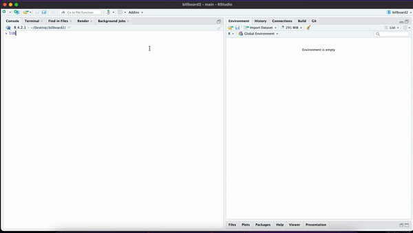

```{r, include = FALSE}
knitr::opts_chunk$set(
  collapse = TRUE,
  comment = "#>",
  fig.path = "man/figures/README-",
  out.width = "100%"
)
```

# singR 


<!-- badges: start -->
  [](https://github.com/aacharya23/billboard_music/actions/workflows/R-CMD-check.yaml)
<!-- badges: end -->
 
### Overview
singR contains data from the Billboard Hot 100 chart and Spotify song and album music characteristics. This package features functions that allow users to perform elementary data analysis and visualization. The functions in the package allow users to analyze the top N songs of all time. The package currently contains dependencies on dplyr.


### Target Audience
This package was made for anyone who find value in music stats. This package can easily be used for data analysis and provide actionable insights for artists, record labels, or anyone who's interested in the Billboard Hot 100.


### Installation 

You can install singR from GitHub with: 

```{r, eval= FALSE}
devtools::install_github("aacharya23/singR")
```

### Datasets Included 
+ `top100`: A dataset that contains the date, song name, artist, current rank and past rank of the Billboard Hot 100 songs.
+ `spotify_all`: a list of songs from Spotify including sound metrics like danceability, acousticness, and loudness, and album information like markets sold in and release date. 

### Functions Included

Functions inside the package:

+ `top_n`: find top artists and songs over a period of time on the Billboard Hot 100 chart
+ `visualize`: visualize the output of top_n as a bar chart
+ `explicit_model`: create linear regression model of "explicit" variable in the Spotify dataset 

### Package Usage Examples

Load singR R package. 

```{r}
# Load the package 
library(singR)

```

1. Find the top 10 artists of all time. 


```{r}
# Run the top_n function with the number 10 to find the top 10 artists of all time 
top_n(id = "song", n = 10)
```
2. View the top 10 artists and their album type as a bar chart. 
```{r}
visualize(spotify_all)
```
3. Regression model that finds whether year is a significant predictor for the explicitness of a song. 
```{r}
explicit_model(spotify_all, "year")
```

To learn more about how to use our package, you can view the full tutorial on YouTube [here](https://youtu.be/G8jblM8aEj0).

## Contributors

- Amrita Acharya
- Lillian Fok
- Brianna Mateo
