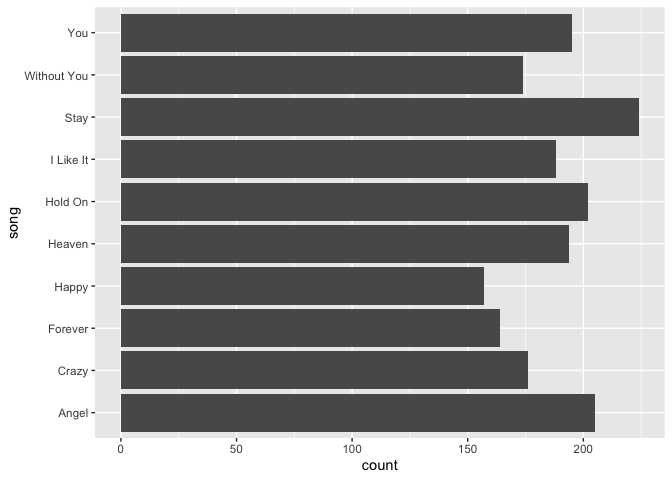

# singR 

<!-- badges: start -->

[](https://github.com/aacharya23/billboard_music/actions/workflows/R-CMD-check.yaml)
<!-- badges: end -->

### Overview

singR contains data from the Billboard Hot 100 chart and Spotify song
and album music characteristics. This package features functions that
allow users to perform elementary data analysis and visualization. The
functions in the package allow users to analyze the top N songs of all
time, visualize it and run a regression model predicting explicitness of
songs based on user inputted variables. The package currently contains
dependencies on dplyr, stats and ggplot2.

### Target Audience

This package was made for anyone who find value in music stats. This
package can easily be used for data analysis and provide actionable
insights on artists, albums and market popularity.

### Installation

You can install singR from GitHub with:

``` r
devtools::install_github("aacharya23/singR")
```

### Datasets Included

- `top100`: A dataset that contains the date, song name, artist, current
  rank and past rank of the Billboard Hot 100 songs.
- `spotify_all`: a list of songs from Spotify including sound metrics
  like danceability, acousticness, and loudness, and album information
  like markets sold in and release date.

### Functions Included

Functions inside the package:

- `top_n`: find top artists and songs over a period of time on the
  Billboard Hot 100 chart
- `visualize`: visualize the output of top_n as a bar chart
- `explicit_model`: create linear regression model of “explicit”
  variable in the Spotify dataset

### Package Usage Examples

Load singR R package.

``` r
# Load the package 
library(singR)
```

1.  Find the top 10 artists of all time.


``` r
# Run the top_n function with the number 10 to find the top 10 artists of all time 
ex<- top_n(id = "song", n = 10)
```

2.  View the top 10 songs and the number of weeks they’ve charted as a
    bar chart.

``` r
visualize(ex)
```

 3.
Regression model that finds whether year is a significant predictor for
the explicitness of a song.

``` r
explicit_model(spotify_all, "year")
#> 
#> Call:
#> lm(formula = explicit ~ year, data = spotify_all)
#> 
#> Residuals:
#>      Min       1Q   Median       3Q      Max 
#> -0.10835 -0.06441 -0.05089 -0.03399  1.04712 
#> 
#> Coefficients:
#>               Estimate Std. Error t value Pr(>|t|)    
#> (Intercept) -6.719e+00  1.765e-01  -38.08   <2e-16 ***
#> year         3.380e-03  8.809e-05   38.37   <2e-16 ***
#> ---
#> Signif. codes:  0 '***' 0.001 '**' 0.01 '*' 0.05 '.' 0.1 ' ' 1
#> 
#> Residual standard error: 0.2179 on 69520 degrees of freedom
#> Multiple R-squared:  0.02073,    Adjusted R-squared:  0.02072 
#> F-statistic:  1472 on 1 and 69520 DF,  p-value: < 2.2e-16
```

To learn more about how to use our package, you can view the full
tutorial on YouTube [here](https://youtu.be/G8jblM8aEj0).

## Contributors

- Amrita Acharya
- Lillian Fok
- Brianna Mateo
